# System Architecture and Design
## Face and RFID Attendance System

**Version:** 2.0
**Companion document:** `SYSTEM_REQUIREMENTS.md`

This document describes how the system is built. Every design decision here exists to satisfy a requirement in the SRS; where the connection is not obvious, the relevant requirement is cited.

Diagrams are kept deliberately small. Each one answers a single question. A diagram that tries to show everything at once shows nothing clearly.

---

## 1. Context: The Two Halves

At the highest level there are only two things and one link between them.

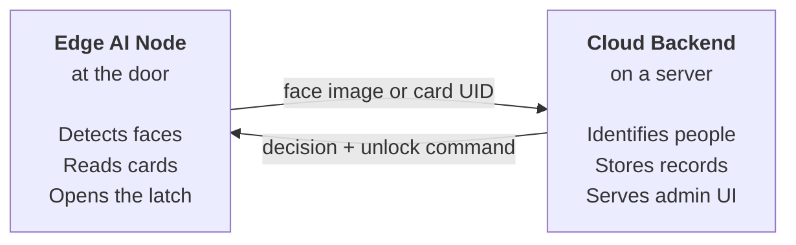

**Why the split falls here.** The processor at the door can run a small model that finds faces. It cannot run the much larger model that identifies them, and it cannot hold the user database. So the device answers *"is someone there?"* and the server answers *"who is it?"* (CON-7, CON-8).

Everything else in this document is an expansion of one of these two boxes, or of the link between them.

---

## 2. The Edge AI Node

### 2.1 Physical Connections

The controller sits in the middle. Everything else connects to it. Nothing connects to anything else.

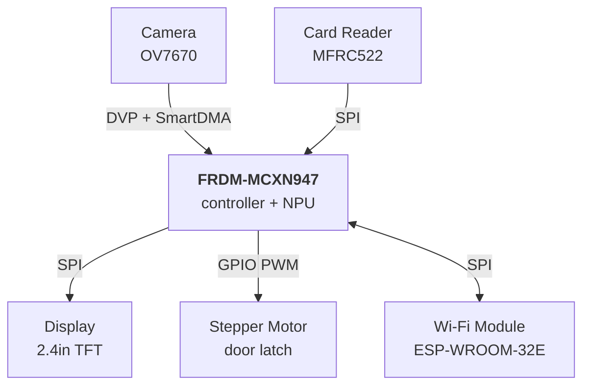

### 2.2 What Each Part Does

| Part | Role | Notes for implementation |
|---|---|---|
| **MCXN947** | Owns the state machine, runs the detection model on the NPU, drives every peripheral | The only component that makes decisions |
| **OV7670** | Streams raw frames | No onboard JPEG. Configure over SCCB at boot, then pull frames with SmartDMA — this is the peripheral NXP provides for DVP capture on MCX N |
| **MFRC522** | Reports a card UID when one is present | Makes no access decision (FR-10) |
| **TFT display** | Output only | Must never block other work — a long display write during a card tap loses the tap |
| **Stepper motor** | Output only | Needs its own power rail. Defaults to locked (SR-6) |
| **ESP-WROOM-32E** | Network transport only | Deliberately contains no business logic, so all security-relevant code stays in one place |

### 2.3 Firmware Structure

The firmware is organized as concurrent tasks around a single state machine. Events flow inward; commands flow outward.

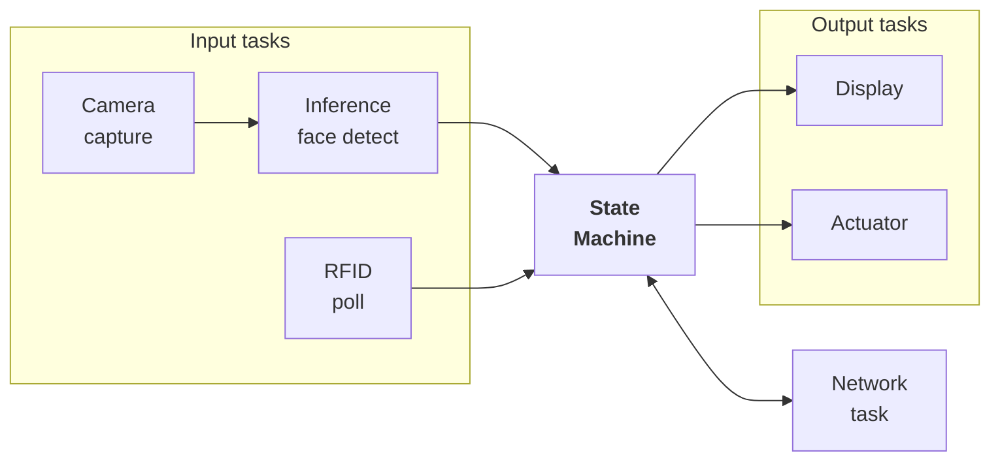

**Three rules that prevent the usual embedded bugs:**

1. **Only the state machine changes state.** Other tasks send it events. They never mutate state themselves. Without this rule, two subsystems eventually disagree about what the device is doing.
2. **Output tasks never block.** The display and actuator run independently so a slow render cannot cause a missed card tap.
3. **The actuator defaults to locked.** If anything anywhere fails, the door stays shut (SR-6).

The camera task uses a double buffer, so inference runs on one frame while the next is being captured. This is what makes the 5 fps target (PR-3) achievable.

### 2.4 Device States

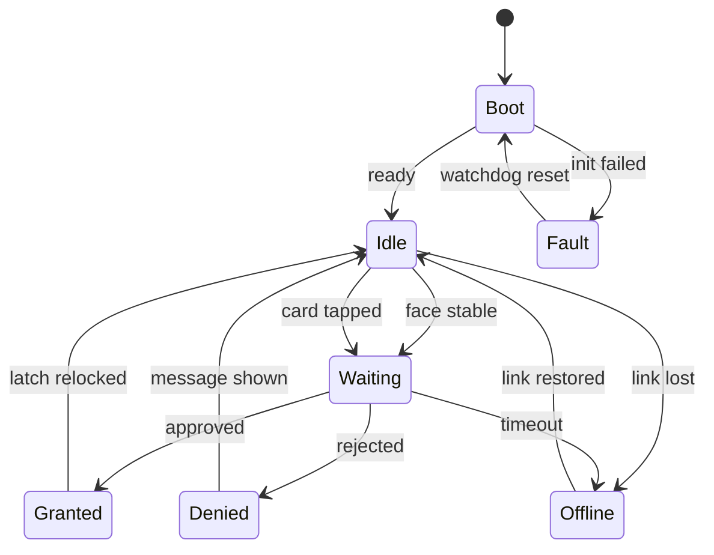

| State | Display shows | Latch |
|---|---|---|
| `Boot` | Starting up | Locked |
| `Idle` | Ready | Locked |
| `Waiting` | Processing | Locked |
| `Granted` | Welcome, {name} | **Unlocked** |
| `Denied` | Not recognized | Locked |
| `Offline` | Offline mode | Locked |
| `Fault` | Service unavailable | Locked |

Note that the latch is unlocked in exactly one state. That is the whole of the access control logic on the device.

---

## 3. The Cloud Backend

### 3.1 Internal Structure

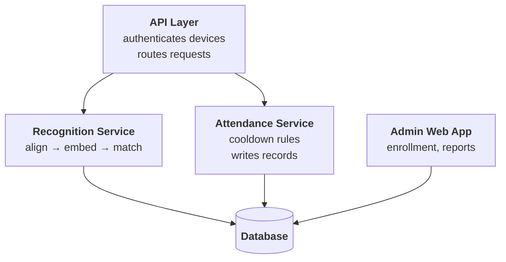

### 3.2 The Recognition Pipeline

This is the sequence inside the Recognition Service. It runs left to right with no branching until the final comparison.

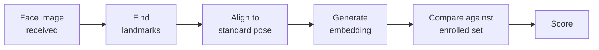

| Stage | What it does | How |
|---|---|---|
| **Find landmarks** | Locates eyes, nose, mouth corners | Detection model with landmark output |
| **Align** | Rotates and scales so the face sits in a standard position | Similarity transform — pure geometry, not a neural network |
| **Embed** | Turns the aligned face into a fixed-length vector | ArcFace (recommended) or FaceNet |
| **Compare** | Measures similarity against every enrolled embedding | Cosine similarity; brute force is fast enough below a few thousand users (ASM-3) |
| **Score** | Best match, compared against the configured threshold | Threshold is configurable (AR-3) |

### 3.3 Model Choices

**On the device — detection only.** The model must be INT8 quantized and compiled for the Neutron NPU, with a small input size such as 128×128. Candidates: Ultra-Light-Fast-Generic-Face-Detector, BlazeFace, or a face detector from the NXP eIQ Model Zoo. The Model Zoo option has the practical advantage of already being validated on this silicon.

**On the server — recognition.** ArcFace with a ResNet backbone is the recommended choice, producing 512-dimensional embeddings. FaceNet is a lighter alternative producing 128-dimensional embeddings.

Do not select a model on published benchmarks alone. Requirement AR-4 says accuracy is measured on this hardware at the installation site, and the gap between benchmark and reality is usually large.

---

## 4. Main Flows

Each flow is shown twice: once as an exchange between systems, and once as the detail inside whichever system does the interesting work. This keeps each diagram narrow enough to read.

### 4.1 Face Attendance — Between Systems

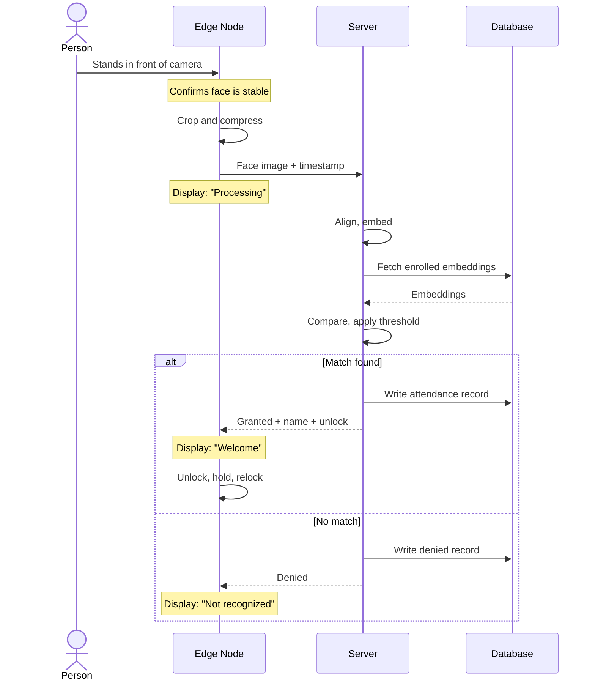

### 4.2 Face Attendance — Inside the Edge Node

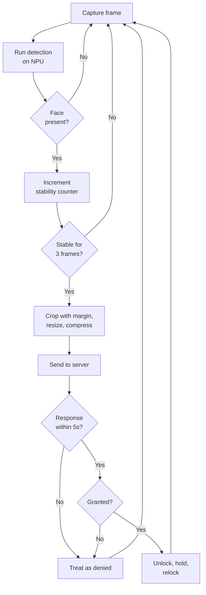

The stability counter implements FR-2. Without it, the system fires at everyone who walks past the door.

### 4.3 Face Attendance — Inside the Server

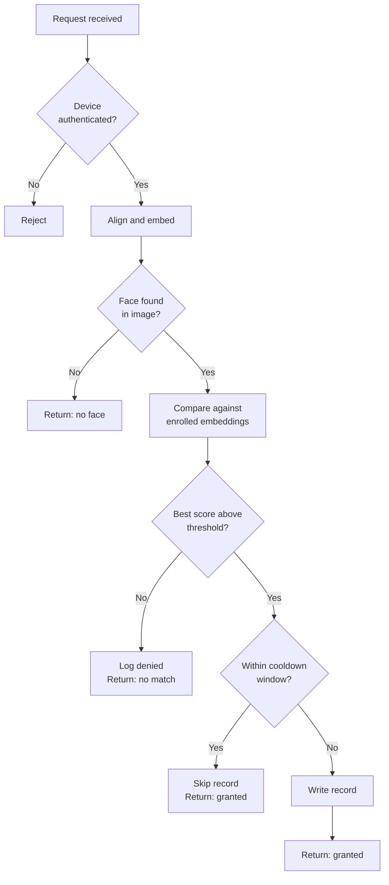

**The cooldown branch is worth pausing on.** If someone was recorded five minutes ago and comes back, we still open the door — we simply do not write a second attendance record. Refusing entry because attendance was already taken would be a poor experience, and requirement FR-14 forbids it.

### 4.4 Card Attendance

Simpler, because no AI is involved on either side. The device is purely a relay.

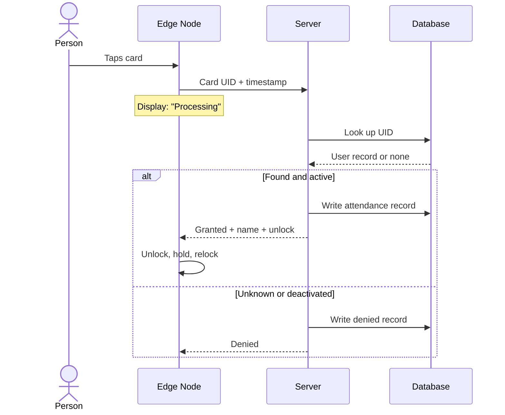

**Why the UID is never checked on the device (FR-10).** If it were, revoking a lost card would mean reprogramming every door in the building. Keeping the decision on the server makes revocation instant and central.

### 4.5 Offline Operation

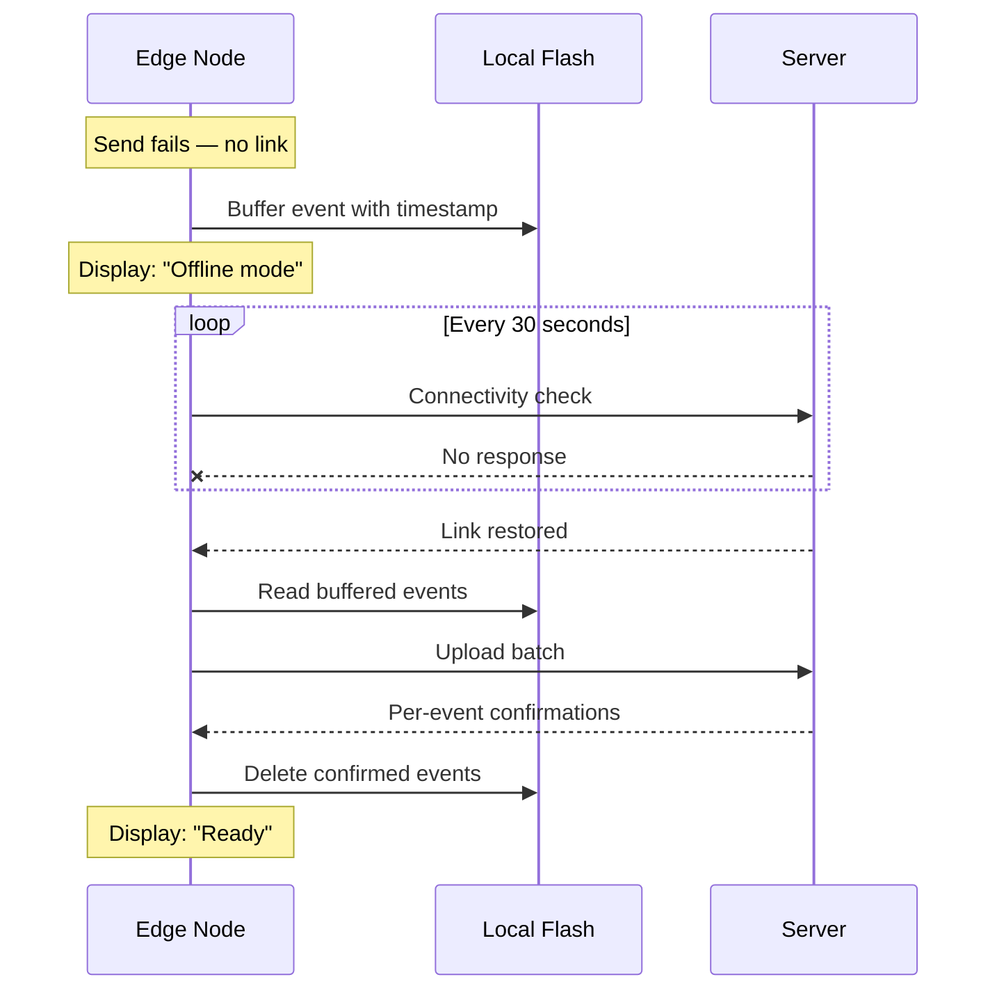

**Two details that are easy to get wrong:**

Events carry the time they *happened*, not the time they were uploaded (FR-21). An event buffered at 08:00 and uploaded at 11:00 must appear in the record as 08:00.

Events are deleted from flash only after the server confirms each one (FR-22). Deleting on upload rather than on confirmation loses records whenever a connection drops mid-transfer.

### 4.6 Enrollment

Happens entirely through the web application. No device involvement.

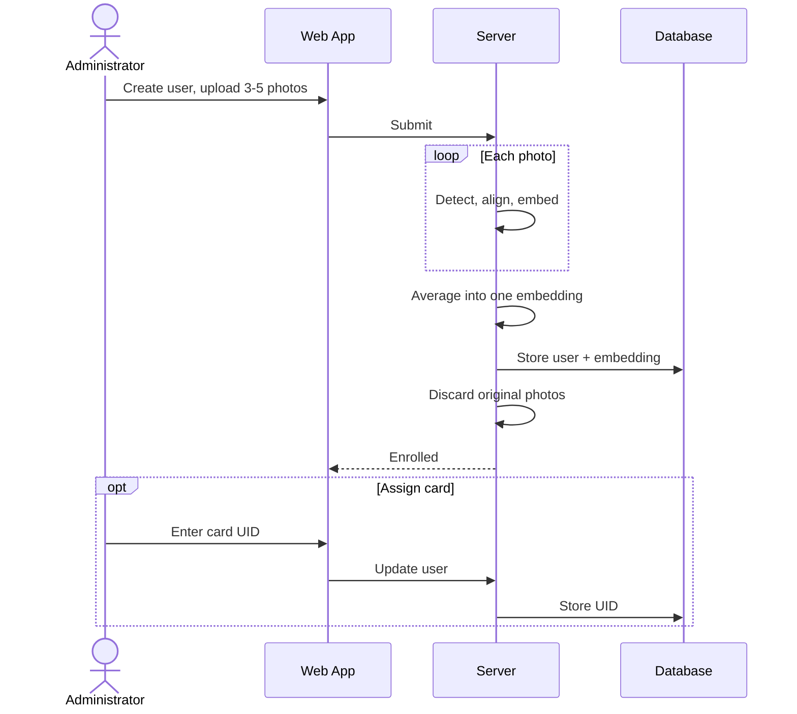

**Why several photos.** One photo captures one lighting condition and one angle. Averaging across several gives a more robust representation and measurably reduces false rejections (AR-2).

**Why the originals are discarded (DR-2).** An embedding cannot be reversed back into a usable photograph. Keeping only embeddings means a database breach leaks far less than a breach of a photo archive would.

---

## 5. Interface Design

### 5.1 Device to Server

Communication is request-response over HTTPS. The device is always the initiator; the server never pushes.

| Purpose | Direction | Carries |
|---|---|---|
| Face attendance | Device → Server | Cropped face image, device ID, timestamp |
| Card attendance | Device → Server | Card UID, device ID, timestamp |
| Batch upload | Device → Server | Array of buffered events |
| Configuration fetch | Device → Server | Device ID; returns thresholds and durations |
| Heartbeat | Device → Server | Device ID; server updates last-seen |
| Decision | Server → Device | Outcome, name if identified, unlock command and duration, message to display |

Each device authenticates with a unique credential (CI-2). The decision response includes the display message rather than the device composing it, so wording can be changed centrally.

### 5.2 Data Volumes

| Link | Payload | Approximate size |
|---|---|---|
| Face event | Cropped JPEG | 10–30 KB |
| Card event | UID + metadata | under 100 bytes |
| Decision | JSON response | under 500 bytes |

The face event is the only payload large enough to threaten the 2-second target (PR-1). This is the measurement called for by open issue OI-2.

---

## 6. Build Order

Sequenced so that each phase produces something testable, and so the riskiest unknowns surface early.

| Phase | Work | Proves |
|---|---|---|
| **1** | Bring up each peripheral in isolation — camera dumping a frame, display showing a test pattern, reader returning a UID, motor turning | The hardware works |
| **2** | Server API with a stub recognizer that always grants, plus the database schema | The device team has something real to develop against |
| **3** | End-to-end network path with dummy data | The integration pain is found early, not late |
| **4** | Full card attendance flow | The whole architecture works, with no AI involved |
| **5** | Detection model on the NPU; benchmark frame rate; tune the stability filter | PR-3 is achievable |
| **6** | Real recognition on the server; tune the threshold against enrolled users | AR-1 and AR-2 are achievable |
| **7** | Offline buffering, admin web app, hardening | The remaining requirements |

Phase 4 before Phase 5 is deliberate. Card attendance exercises every part of the architecture except the models. If something structural is wrong, it is far cheaper to find out before the AI work starts.

---

## 7. Design Risks

| Risk | Consequence | What to do |
|---|---|---|
| Camera performs poorly in low light (OI-1) | AR-1 and AR-2 missed at an entrance in the evening | Test under real lighting in Phase 1. Be prepared to add illumination or change the camera |
| Device-to-network bandwidth insufficient (OI-2) | PR-1 missed on face attendance | Measure in Phase 3. Reduce image size or compression quality if needed |
| Detection model too slow on the NPU | PR-3 missed; sluggish response | Benchmark several candidates in Phase 5. Reduce input resolution if needed |
| Flash too small for offline face buffering (OI-3) | RR-5 partly unmet | Fall back to buffering card events only, and refuse face attendance while offline |
| No software JPEG encoder on the device | CPU cost eats into PR-1 | Measure whether sending a raw downscaled image is cheaper end to end than compressing first |
| **Photograph spoofing (SR-7)** | Unauthorized access using a printed or on-screen photo | Documented as a known limitation of this release. Sites needing protection must not use face recognition as sole access control |

The last row is not a risk to be managed away by careful engineering. It is a property of the system as scoped. It must be stated to whoever deploys it.
