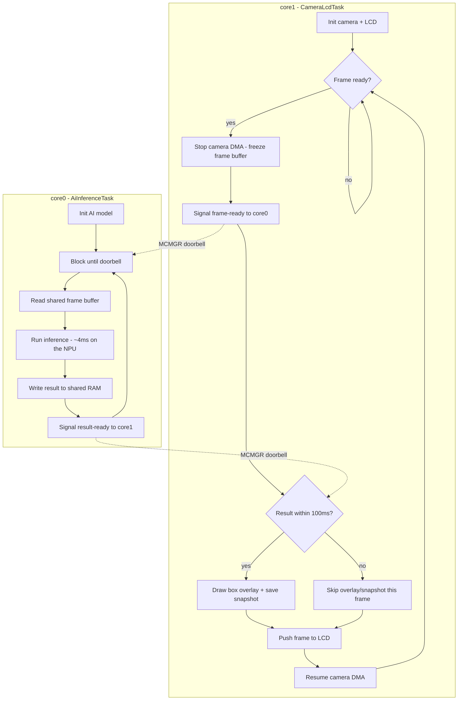
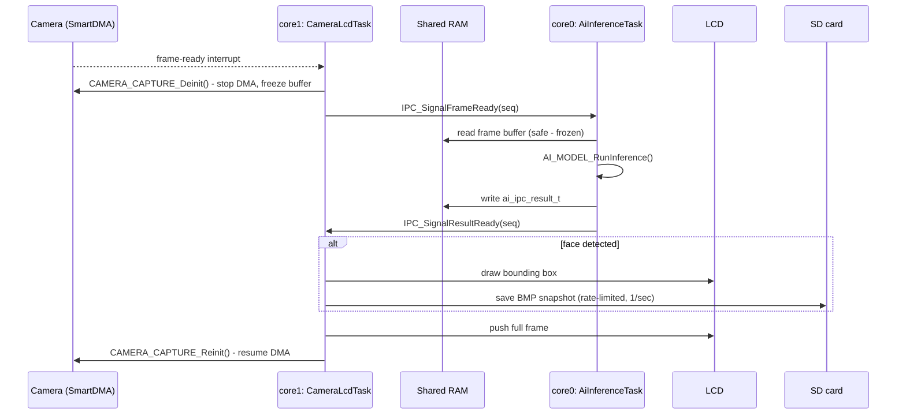

# Architecture

Design decisions and internal mechanics for this project. For build/run
instructions see [README.md](README.md); for the dated bring-up history
see [WORKLOG.md](WORKLOG.md).

## 1. System Overview

```
[OV7670 camera] --DVP(PCLK/HREF/VSYNC)--> [SmartDMA coprocessor] --frame buffer-->
  --> [AI inference: CPU/CMSIS-NN or Neutron NPU] --> [LCD status text, bit-bang GPIO]
                                                    \-> [SD snapshot (LPSPI1), only on face detection]
```

Camera capture and AI inference run **sequentially, not in parallel** (see
§3) on core0 only — this is a single-core application despite the MCXN947
being dual-core (core1 never boots, see §4). Two coprocessors do the heavy
lifting off the main Cortex-M33: SmartDMA assembles camera frames without
CPU involvement, and the Neutron NPU (default backend) runs the
model's convolution-heavy layers without CPU involvement.

## 2. Components

### Camera capture — `source/camera/camera_capture.c`

- **Responsibility:** drive the OV7670 over SCCB (config) and DVP
  (PCLK/HREF/VSYNC/D0-D7, pixel data), using SmartDMA to assemble frames.
- **Why SmartDMA, not a software loop:** DVP is a parallel interface with
  camera-driven timing (not synchronized to the CPU); at 320x240@30fps
  (~2.3 MB/s) a software GPIO-polling loop can't keep up. SmartDMA is a
  separate programmable coprocessor that runs its own microcode
  understanding DVP timing directly, assembling frames in parallel with
  whatever the main core is doing.
- **Key APIs:**
  ```c
  SMARTDMA_InstallFirmware(SMARTDMA_CAMERA_MEM_ADDR, s_smartdmaCameraFirmware, ...);
  SMARTDMA_InstallCallback(CAMERA_CAPTURE_CompleteCallback, NULL);
  NVIC_EnableIRQ(SMARTDMA_IRQn);
  SMARTDMA_Boot(kSMARTDMA_CameraWholeFrameQVGA, &smartdmaParam, 0x2);
  ```
  Completion fires `SMARTDMA_IRQn` → `CAMERA_CAPTURE_CompleteCallback()` →
  sets a flag the main loop polls. Main CPU never touches pixel-level
  timing.
- **Gotcha:** the first frame captured immediately after
  `CAMERA_CAPTURE_Reinit()` is not yet synced and must be discarded (see
  WORKLOG.md for the bug this caused: every frame reading back flat/zero
  in the AI-integrated build).

### AI inference — `source/ai/model_runner.h` (+ two backends)

- **Responsibility:** run the FOMO face-detection model on a captured
  frame; identical API (`model_runner.h`) for both backends, selected at
  build time via `AI_MODEL_USE_NPU`.
- **CPU backend** (`model_runner.cpp`): Edge Impulse's own
  `ei_run_classifier()`, non-EON TFLite Micro interpreter.
- **NPU backend** (`model_runner_npu.cpp`): bypasses Edge Impulse's SDK
  entirely (its `ei_run_classifier()` has no hook for registering a custom
  op) and talks to TensorFlow Lite Micro directly:
  ```cpp
  static tflite::MicroMutableOpResolver<3> s_opResolver;
  s_opResolver.AddSlice();
  s_opResolver.AddSoftmax();
  s_opResolver.AddCustom(tflite::GetString_NEUTRON_GRAPH(), tflite::Register_NEUTRON_GRAPH());
  tflite::MicroInterpreter interpreter(model, s_opResolver, tensorArena, arenaSize);
  interpreter.AllocateTensors();
  interpreter.Invoke();  // NEUTRON_GRAPH portion runs on the NPU
  ```
  `neutronInit()` (real hardware init) is called lazily, internally, by the
  `NEUTRON_GRAPH` kernel on its first `Prepare()` — no manual NPU-start
  call needed anywhere in application code.
- **Model conversion for NPU:** the `.tflite` Edge Impulse Studio exports
  must be run through NXP's `neutron_converter` CLI (`eiq_neutron_sdk`
  package) before use:
  ```bash
  neutron_converter --input model.tflite --target mcxn94x --output model_npu.tflite
  ```
  This collapses supported layers (conv/pool/add/...) into one custom
  `NEUTRON_GRAPH` op; unsupported layers (`Slice`, `Softmax` for this
  model) stay as regular TFLM ops. Current model: 31/33 ops folded into
  the NPU op.
- **Timing:** measured by hand via the Cortex-M33 DWT cycle counter
  (`DWT->CYCCNT` → microseconds via `SystemCoreClock`), not Edge Impulse's
  own `ei_result.timing` field — that field reads `0` on this
  SDK/porting combination (`ei_read_timer_us()` is hard-coded to return 0
  in the bare-metal clib porting layer).
- **Gotcha:** quantization for this model reduces to `pixel_value - 128`
  (scale ≈ 1/255, zero_point = -128) — no runtime division/multiplication
  needed, convenient on an MCU without a FPU-heavy quantization path.

### Display — `source/display/lcd_spi_hw.c` (default) / `lcd_bitbang.c`, `lcd_flexio_mculcd.c` (abandoned J8 path)

- **Responsibility:** draw fixed text status lines (`FACE: 1`/`0`,
  `CAPTURE: 1`/`0`) via hardware LPSPI1 on the Arduino header (previously
  bit-banged 8080 parallel, then bit-banged SPI, before settling on
  hardware SPI shared with the microSD/touch bus - see WORKLOG.md).
- **Key APIs:** `LCD_Init()`, `LCD_InitPanel()` (generic MIPI-DCS init
  sequence, works across ILI9481/ILI9486/HX8357/ST7796-family panels),
  `DEMO_DrawStatusLine()` in `main.c`.

### Shared SPI bus — `source/spi1_bus.c` (LCD + microSD + touch)

- **Responsibility:** own the single hardware LPSPI1 peripheral all three
  Arduino-header SPI devices ride (see `source/spi1_bus.h`'s file
  comment for the full sharing contract). Only the microSD slot uses the
  peripheral's real hardware chip-select (PCS0/D10 - `SDSPI_Init()` needs
  runtime PCS-polarity flipping that only works through real PCS
  hardware); the LCD and touch controller each use a plain GPIO pin for
  CS instead, transferring via `kLPSPI_MasterPcs1` (a PCS channel never
  muxed to a physical pin on this board, so it's a "don't care" value).
- **Key APIs:** `SPI1_BUS_Init()` (idempotent - safe to call from every
  device driver's own init), `SPI1_BUS_SetBaudRate()` (must be called
  right before every transaction, not just once - see below),
  `SPI1_BUS_TransferBlocking()`.
- **Why per-transaction baud-rate reclaiming is required:** the three
  devices need different SPI speeds (SD: 400kHz during card
  identification, then up to `SD_SPI_OPERATING_BAUDRATE`; LCD/touch: their
  own conservative starting baud rates), and `main.c`'s loop interleaves
  LCD draws with SD snapshot writes every frame. `sd_spi_disk.c`'s
  `disk_read()`/`disk_write()` and `lcd_spi_hw.c`'s
  `LCD_BeginTransaction()`/`touch_xpt2046.c`'s `TOUCH_ReadChannel()` each
  call `SPI1_BUS_SetBaudRate()` immediately before their own transfer, so
  whichever rate the bus was left at by the last device to use it doesn't
  matter. `SDSPI_Init()` itself is the one exception that doesn't need
  this: `middleware/sdmmc/sdspi/fsl_sdspi.c` already re-asserts the
  400kHz identification speed unconditionally at its own start.
- **UNTESTED on real hardware** - see WORKLOG.md and README.md's Known
  Limitations. This is the newest and highest-risk part of the LCD/SD/
  touch integration.

### SD card snapshot — `source/storage/sd_spi_disk.c` + `snapshot.c`

- **Responsibility:** on face detection, draw a box into the camera frame
  buffer (`bbox_overlay.c`, shared with the abandoned live-image LCD path)
  and save it as a BMP to the microSD card on the TFT panel (Arduino
  D10..D13, shared SPI bus - see above), rate-limited to 1 capture/sec via
  the DWT cycle counter.
- **Why the SDK's own SD-over-SPI FatFs glue isn't used:**
  `middleware/fatfs/source/fsl_sdspi_disk/` is hardcoded to the DSPI
  peripheral (`fsl_dspi.h`), which doesn't exist on the MCXN947 (LPSPI-
  family chip) — `#include`ing it at all triggers a `#error` from inside
  `fsl_sdspi_disk.h` itself. `sd_spi_disk.c` reimplements the same 5
  `diskio.h` functions (`disk_initialize/status/read/write/ioctl`) against
  `fsl_sdspi.h` (the SDK's actual protocol layer, chip-agnostic) with an
  `sdspi_host_t` driving `LPSPI1` directly instead.
- **Why FatFs core (`ff.c`) is pulled directly in `CMakeLists.txt`
  instead of via `CONFIG_MCUX_COMPONENT_middleware.fatfs`:** that Kconfig
  component always bundles `middleware/fatfs/source/diskio.c` alongside
  `ff.c`, which would collide at link time with `sd_spi_disk.c`'s own
  `disk_*` functions. Same reasoning for pulling `fsl_sdspi.c` directly
  instead of via `CONFIG_MCUX_COMPONENT_middleware.sdmmc.sdspi` - that
  option also auto-selects `middleware.sdmmc.common`, which doesn't even
  compile without a host-controller (SDHC/USDHC) component selected
  (`fsl_sdmmc_common.h` unconditionally `#include`s `fsl_sdmmc_host.h`) -
  unnecessary anyway, since `fsl_sdspi.c` never calls into
  `fsl_sdmmc_common.c`.
- **RAM:** `ffconf.h` is hand-written (not Kconfig-generated) with
  `FF_FS_TINY=1` (shares one 512B sector buffer instead of giving every
  open `FIL` its own) and `FF_USE_LFN=0` (fixed 8.3 filenames,
  `FACEnnnn.BMP`) - `m_data` was already >90% used before this feature
  (see README.md), so every static byte here was deliberately fought for.
  The snapshot BMP itself needs **zero** extra frame-sized RAM: it's
  written straight out of the existing camera frame buffer with one
  `f_write()` call (top-down BMP row order matches the buffer's own
  layout; RGB565 needs no pixel-format conversion for a 16bpp BMP).
- **Confirmed on real hardware** (2026-08-25, after fixing 3 bugs found by
  live SWD debugging — see §5) — SD card mounts successfully
  (`Snapshot: SD card ready.`). Not yet separately confirmed: an actual
  face-triggered capture — see README.md's Known Limitations.

## 3. Key Design Decisions

| Decision | Alternative(s) considered | Why this way |
|---|---|---|
| Camera capture and AI inference run sequentially (`CAMERA_CAPTURE_Deinit()` before inference, `_Reinit()` after) | Run in parallel, both using `m_sramx` | Both need the same 96KB `m_sramx` RAM bank at the same time — parallel use silently corrupts SmartDMA's working state (camera stops firing frame-ready interrupts, no error logged). Sequential is slightly slower but inference already dominated total pipeline time, so no real throughput cost. |
| CPU-path tensor arena split across `m_sramx` (primary) + `m_data` (overflow) | Single pool in `m_data` only | Model doesn't fit in `m_data` alone; `m_sramx` looks unused in the linker map (SmartDMA firmware is loaded into it at runtime via a function call, not the static linker) but is only safe to reuse because capture is fully stopped first — see row above. |
| LCD shows text status only, not live image + bounding boxes | Live image + box overlay (the original design) | Bit-bang GPIO bus is too slow to push a full frame plus AI overlay per inference cycle at acceptable rate; text status is enough for the drowsiness/face-presence use case. `bbox_overlay.c/h` is reused by the SD snapshot feature (see below) - just never drawn to the LCD itself. |
| TFT driven via Arduino-header bit-bang, not J8 FlexIO | J8 FlexIO (NXP's hardware-accelerated path) | FlexIO wiring/init confirmed correct (a bit-bang diagnostic on the same J8 pins worked), but the FlexIO hardware-bus path itself produced black/white noise pixel data — unresolved bus-speed/signal-integrity issue. Bit-bang is slower but correct. |
| No USB video streaming | UVC webcam streaming, or a Mid/Overdrive DCDC time-multiplex workaround | Real hardware constraint, not fixable in software — see §4. A working time-multiplex prototype existed but added complexity not justified since the product only needs the LCD status line. |
| core1 never boots; its reserved RAM region is left untouched | Reuse core1's reserved RAM bank for the tensor arena, same reasoning as the `m_sramx` reuse above | Different failure mode from `m_sramx` — see §4. Tried once, wedged the board (silent hang on the very first `.bss` zero-init access), reverted. |

## 4. Known Constraints & Trade-offs

### SmartDMA / AI tensor-arena RAM collision

- **Constraint:** the CPU-path tensor arena and SmartDMA's camera firmware
  cannot occupy `m_sramx` (96KB) at the same time.
- **Root cause:** `SMARTDMA_CAMERA_MEM_ADDR` (`0x04000000`) is the start of
  `m_sramx`; the SDK's board linker script has no output section for it
  because SmartDMA firmware is loaded at runtime, not link time — making
  the bank look free when it isn't.
- **Impact:** capture must be stopped (`CAMERA_CAPTURE_Deinit()`) before
  inference and restarted after — see §3, row 1.

### core1's reserved RAM bank is unsafe to reuse, for a different reason than `m_sramx`

- **Constraint:** cannot reuse the SDK-reserved core1 RAM region
  (`0x2004E000`-`0x20068000`, 104KB) even though core1 never boots in this
  project.
- **Root cause:** on MCX-family (and most NXP multicore) parts, SRAM
  instances are partitioned into separate **power domains**. A domain tied
  to a core that's never released from reset can be left in its default
  low-power/array-off state — accessing it is a bus fault against
  unpowered RAM, not a data-corruption problem like `m_sramx`. Nothing in
  this project's boot code powers up that domain, because nothing here
  ever asks for core1's resources.
- **Impact:** the moment `Reset_Handler`'s `.bss` zero-init loop touched a
  symbol placed in that region, the board produced zero UART output ever
  again — not even the pre-camera/AI boot banner. Confirming actual
  electrical status would require the reference manual's SPC/CMC
  power-domain register detail, not just the linker script. **"Reserved
  for another core that never boots" is a weaker safety argument than
  "reserved for a coprocessor whose activity this firmware controls
  directly" (i.e. the `m_sramx` case above) — don't reuse a region just
  because the current build never references it.**

### USB High-Speed streaming vs. camera capture

- **Constraint:** the camera and USB Video Class streaming cannot run at
  the same time on this board.
- **Root cause:** the MCXN947's DCDC core regulator needs Mid voltage
  (~1.0V) for reliable SmartDMA camera capture, but the USB HS PHY's PLL
  needs Overdrive voltage (~1.2V) to lock — mutually exclusive voltage
  requirements. The board's single USB-C connector is hard-wired to the HS
  controller only (no accessible USB FS alternative — UM12018 §2.3), so
  there's no wiring-level workaround either.
  - **Genuine hardware limitation, not fixable in software** — timing/config
    issues can be fixed in code; a PLL that physically cannot lock below a
    given voltage cannot.
- **Impact:** a working time-multiplexed prototype (periodic Mid ↔
  Overdrive switching) produced low-frame-rate, choppy UVC video; set
  aside since the product doesn't need a USB video feed. Source kept at
  `source/usb/usb_video_camera.c/h` (`-DUSB_STREAM_DIAGNOSTIC_DISABLE=OFF`).

## 5. Debugging & Tooling Notes

### Plain `pyocd flash`/`reset`/`erase` is unreliable on this chip/probe/pyOCD combination

- **Symptom:** `pyocd flash -t mcxn947 <elf>` fails at the
  connection/init stage (never reaches the programming progress bar) with
  one of:
  - `Error while running debug sequence 'DebugPortStart' (core cm33_core0): SWD/JTAG communication failure (WAIT ACK)` or `(FAULT ACK)`
  - `Error while running debug sequence 'ResetCatchClear' (core cm33_core1): ... (FAULT ACK)` (pyOCD's default connect flow touches core1's debug-catch config even though this project only uses core0)
  - `Error while running debug sequence 'ResetSystem' (core cm33_core0): ... (FAULT ACK)`

  `DP IDR` (the most basic SWD register read) always succeeds (`0x6ba02477`)
  — the physical SWD link is fine. The failures are inside this chip's
  CMSIS-Pack-defined debug *sequences*, which need retry logic plain pyOCD
  doesn't have for this pack/probe pairing.
- **What doesn't help:** power-cycling, lowering SWD clock, different
  `--connect` modes, different USB cable/port.
- **Fix — use NXP's `spsdk`/`nxpdebugmbox` instead of relying on pyOCD's
  generic connect flow:**
  ```bash
  pip install spsdk   # provides the nxpdebugmbox CLI

  # 1. Unlock AHB/core access via the Debug Mailbox — must run immediately
  #    before every pyOCD flash/reset call, doesn't persist across a fresh connection
  nxpdebugmbox -i mcu-link cmd -f mcxn947 start-debug-session

  # 2. Flash with the broken debug sequences disabled
  pyocd flash -t mcxn947 \
    -O "pack.debug_sequences.disabled_sequences=ResetCatchSet:cm33_core1,ResetCatchClear:cm33_core1,ResetSystem:cm33_core0,ResetSystem:cm33_core1" \
    <path-to-elf>

  # 3. Disabling ResetSystem means step 2 won't reset into the new image — do it separately
  nxpdebugmbox -i mcu-link tool reset -f mcxn947 -h
  ```
  Mass-erase/recovery works directly, no extra flags:
  ```bash
  nxpdebugmbox -i mcu-link cmd -f mcxn947 erase
  ```
- **ISP mode (SW3 held + SW1) is a red herring for this problem** — it does
  enter ROM bootloader mode (error signature changes to
  `Invalid AP address (#0)`), but `nxpdebugmbox erase`/`start-debug-session`
  work fine without it. Note `nxpdebugmbox`'s `write-to-flash` does *not*
  work outside a specific device life-cycle state — use it only for
  `erase`/`start-debug-session`, then hand off to `pyocd flash` for actually
  programming.
- **Takeaway:** for MCX-family (and likely other LPC55xx-lineage) NXP
  parts, if pyOCD's CMSIS-Pack connect flow faults on `WAIT ACK`/`FAULT ACK`
  inside a chip-specific debug sequence (not a plain register read), reach
  for `spsdk`/`nxpdebugmbox` rather than varying pyOCD-level knobs.

### SD card init hung the whole boot, then never worked at all - three separate bugs, all found and fixed by live SWD register inspection on real hardware

**Symptom:** boot hung completely - confirmed on real hardware
(2026-08-25) - no serial output past `LCD: bit-bang GPIO on the Arduino
header`, survived repeated resets (deterministic: same code path, same
result, every time). CONFIRMED FIXED as of this entry - see the end of
this section for the working log output.

**Bug 1 - `LPSPI_MasterTransferBlocking()` has literally no timeout unless
`SPI_RETRY_TIMES` is defined:**
`drivers/lpflexcomm/lpspi/fsl_lpspi.c` polls TX/RX FIFO status flags in
loops shaped like:
```c
#if SPI_RETRY_TIMES
    waitTimes = SPI_RETRY_TIMES;
    while ((...) && (--waitTimes != 0U))
#else
    while (...)
#endif
    { }
```
repeated ~19 times through that file. Whether this ever times out depends
entirely on the `SPI_RETRY_TIMES` **preprocessor macro** being defined
with a nonzero value by *someone* - it is not a runtime parameter. The
obvious place to set it, `CONFIG_SPI_RETRY_TIMES`, is a real Kconfig
option - but it's declared inside `drivers/lpspi/Kconfig`, gated under
the plain `driver.lpspi` component, which is for MCX chips where LPSPI is
its own standalone IP block. This chip's LPSPI1 lives inside a
`LP_FLEXCOMM` interface instead, gated by the separate
`driver.lpflexcomm_lpspi` component (see §2's SD card snapshot entry for
why that's the right component here) - and `drivers/lpflexcomm/lpspi/
Kconfig` has no `SPI_RETRY_TIMES` option at all. With this board's
*correct* Kconfig component enabled, the macro is simply never defined
anywhere, `#if SPI_RETRY_TIMES` evaluates false (undefined == 0), and
every one of those ~19 loops compiled to an unconditional `while (...) {}`
- a real infinite loop if the condition it's waiting on never becomes
true. **Fix:** define it directly in `CMakeLists.txt`, bypassing Kconfig
(same pattern as this project's other Kconfig-gap workarounds):
```cmake
mcux_add_macro(CC "-DSPI_RETRY_TIMES=100000")
```

**Bug 2 - fixing bug 1 alone converted "infinite hang" into "hang so long
it's indistinguishable from infinite in practice":** after bug 1's fix,
the board *still* didn't visibly progress past SD init after several
minutes. Diagnosed by halting the core over SWD mid-hang
(`pyocd commander -c halt -c reg`) and reading it repeatedly - the PC
*was* moving (inside `LPSPI_CombineWriteData`/`LPSPI_MasterTransferBlocking`,
not frozen at one address), meaning the CPU was doing real, bounded work,
just an enormous amount of it. Reading LPSPI1's own registers directly
over SWD (`CR`@0x40093010, `SR`@0x40093014, `FSR`@0x4009305C,
`RDR`@0x40093074 - offsets from `devices/MCX/MCXN/periph/PERI_LPSPI.h`)
confirmed the peripheral itself was configured and completing real
transfers correctly (`CR.MEN=1`, transfers finishing, `TCR` frame size
correct) - **but every response byte read back as `RDR=0x00`, never the
`0xFF` idle-high value SD-over-SPI expects.** `middleware/sdmmc/sdspi/
fsl_sdspi.c`'s own retry constant (`SDSPI_TRANSFER_RETRY_TIMES`, hardcoded
`20000`, not `#ifndef`-guarded so not overridable via `-D`) is nested up
to 2-3 levels deep in `SDSPI_Init()`'s call graph (e.g.
`SDSPI_ApplicationSendOperationCondition()`'s outer poll calls
`SDSPI_SendCommand()` which itself calls `SDSPI_WaitReady()`, each with
its own 20000-retry budget) - when every single response byte is wrong,
*every* nested wait maxes out its own budget, multiplying instead of
adding: 20000 × 20000 in the worst case, at ~20us/byte (SD init's
mandatory 400kHz clock) - minutes to hours, not the few seconds any of
the individual bounded loops implies on its own.

**Fix** (`source/storage/sd_spi_disk.c`): rather than trying to patch
`fsl_sdspi.c`'s own retry constants (hardcoded, and this project avoids
editing vendored SDK files directly), `SDCARD_SPI_Exchange()` - the
`sdspi_host_t.exchange` callback, which `fsl_sdspi.c` calls for *every*
single SPI transaction and immediately propagates a failure from, no
retry - now tracks its own short (2 second) wall-clock deadline via the
DWT cycle counter, armed once per `SDSPI_Init()` attempt in
`SDCARD_SPI_Init()`. Once the deadline passes, every subsequent
`exchange()` call returns failure immediately without touching hardware,
which unwinds every one of `fsl_sdspi.c`'s nested retry loops in one shot
regardless of how large their own internal budgets are. This is what
actually bounds total `SNAPSHOT_Init()` time to ~2 seconds, not bug 1's
fix alone.

**After bugs 1+2**, boot no longer hung, but the card still never
communicated - `RDR` (LPSPI1's received-byte register) read a constant
`0x00` on every single poll, never the SD-over-SPI idle-high `0xFF`,
so `SDSPI_Init()` correctly (per the bug 2 fix) failed fast every time:
```
Snapshot: initializing SD card (LPSPI1, D10..D13)...
Snapshot: SD card init timed out after 2000ms (no valid response) - giving up.
Snapshot: no usable SD card on the shield's slot (D10..D13) - snapshots disabled.
```
Ruled out first: the card itself (mounted cleanly as FAT32 in this
laptop's own SD reader) and basic seating (card confirmed in the
shield's slot, shield confirmed fully seated in the Arduino header).

**Bug 3 - the TFT shield's SD slot has no pull-up on the DO (MISO) line,
and `BOARD_InitSdCardPins()` didn't add one either:** cheap SD shields
commonly omit this, assuming the host board provides it - this project's
pin setup was copied from the SDK's own LPSPI1 b2b loopback example,
which never needs one (it talks to another on-chip LPSPI instance wired
directly on the same board, not through a connector to 3rd-party
hardware). With nothing pulling DO toward a defined level when the card
isn't actively driving it, the input floated and happened to settle on a
stable `0x00` - electrically indistinguishable from a genuine short
purely from software.

**Diagnosis:** rather than guessing, tested directly - added this chip's
own weak internal pull-up (`kPORT_PullUp`) to just the SDI/DO pin
(`board_port/pin_mux.c`) as a live experiment: a floating line should
read differently once pulled toward a level; a truly shorted/driven-low
line wouldn't budge, since a weak internal pull can't override an active
driver. Rebuilt, reflashed - the very next boot:
```
Snapshot: initializing SD card (LPSPI1, D10..D13)...
Snapshot: SD card ready.
AI_MODEL_RunInference: total classifier time = 3879us (3ms)
Camera: frame #16 ready, 792 samples, pixel range 0x2965..0xD65B, avg=0x6426
```
Confirmed floating on the first try - the pull-up is now a permanent part
of `BOARD_InitSdCardPins()`, not a diagnostic-only change; it's genuinely
required for this shield on this board.

**Takeaways:**
- When adding a new peripheral driver from an NXP example, check whether
  that example's Kconfig component is the same one your actual chip/board
  needs - components with near-identical names (`driver.lpspi` vs.
  `driver.lpflexcomm_lpspi` here) can gate genuinely different Kconfig
  option sets, and a *silently-undefined* safety macro is a much worse
  failure mode than a build error would have been.
- A chain of individually-bounded retry loops is not itself bounded - if
  loop A (budget *m*) calls loop B (budget *n*) on every one of its own
  iterations, the real worst case is *m*×*n*, not *m*+*n* or
  max(*m*,*n*). Don't assume a "shouldn't take long" component's own
  internal timeout is a usable upper bound for code that calls it in a
  retry loop of your own.
- Live SWD register inspection (`pyocd commander -c halt -c reg -c
  "read32 <addr>" -c go`) settled in minutes what static code reading
  alone couldn't - "is the PC moving" (real work vs. frozen) and "what's
  actually in the peripheral's data register" (protocol-level vs.
  electrical-level problem) are both directly observable without needing
  the target to cooperate (print, breakpoint, etc), which matters exactly
  when the target *is* the thing that's stuck.
- "MCU reads garbage from an SPI slave" has (at least) two electrically
  distinct causes that look identical in software - a genuine short/wrong
  signal, or a legitimately floating/undriven line with nowhere for the
  logic level to be pulled toward. Toggling the MCU's own weak internal
  pull-up and re-testing is a cheap, fast, non-destructive way to tell
  them apart on real hardware before reaching for a multimeter.

## 6. References

- NXP UM12018 (FRDM-MCXN947 board user manual), §2.3 — USB connector wiring
- `neutron_converter` / `eiq_neutron_sdk` — NXP package index
- `spsdk` / `nxpdebugmbox` — NXP Debug Mailbox tooling

## 7. Dual-Core Task Architecture (RTOS build)

Everything in §1-§6 above describes the **legacy single-core build**
(core1 never boots). The dual-core build (`-DDUALCORE_RTOS=ON`, see
README.md) splits the same pipeline across both cores under FreeRTOS:
**core1** owns camera + LCD + SD (one task, `CameraLcdTask`), **core0**
owns AI inference only (one task, `AiInferenceTask`). They talk over
MCMGR mailbox-interrupt doorbells and a fixed shared-RAM region — no
RPMsg-Lite, no OS-level IPC framework.

### 7.1 Boot sequence

core1 has no SAU on this chip (always Non-Secure — see KNOWLEDGE.md §9),
so core0 must grant it GPIO access *before* releasing it, and must finish
the whole MCMGR handshake *before* touching any FreeRTOS API (both are
real bugs this project hit — see WORKLOG.md):

```mermaid
sequenceDiagram
    participant C0 as core0 (main_core0.c)
    participant GPIO as GPIO0 / GPIO1 (PCNS)
    participant C1 as core1 (main_core1.c)

    C0->>C0: MCMGR_Init(), BOARD_InitHardware()
    C0->>GPIO: Grant PCNS (Non-Secure access) for core1's LCD pins
    C0->>C1: copy core1's image into RAM
    C0->>C1: MCMGR_StartCore() - release core1
    activate C1
    C1->>C0: MCMGR_GetStartupData() - wait for core0's handshake
    C1->>C1: BOARD_InitHardware(), SPI1_BUS_CreateLock()
    C1->>C1: xTaskCreate(CameraLcdTask); vTaskStartScheduler()
    deactivate C1
    C0->>C0: xTaskCreate(AiInferenceTask); vTaskStartScheduler()
```

### 7.2 Per-core task flow



### 7.3 One frame, end to end



### 7.4 How data actually moves

Both cores physically share one fixed RAM region
(`source/shared/ipc_layout.h`, carved out of core0's `m_data` since a
153,600-byte QVGA frame doesn't fit in core1's own 104KB region at all).
Nothing is copied across cores — both sides read/write the exact same
physical bytes through fixed addresses; only a 16-bit sequence number
actually travels through the doorbell interrupt itself.

| Data | Written by | Read by | Only safe when |
|---|---|---|---|
| Camera frame buffer (`IPC_FRAME_BUFFER_ADDR`, 153,600B) | SmartDMA, via core1 | core0 (inference), core1 (LCD push) | Between core1's `CAMERA_CAPTURE_Deinit()` and `Reinit()` - DMA is stopped, buffer is frozen |
| AI result (`IPC_RESULT_ADDR`, `ai_ipc_result_t`) | core0, after inference | core1, after `IPC_SignalResultReady()` | Any time after the doorbell for that frame's sequence number |
| Sequence number | Both (via the doorbell payload) | Both | Used to detect a stale/late reply, not to move real data |

The AI result uses its **own** plain-data struct (`ai_ipc_result_t`), not
`model_runner.h`'s `ai_model_result_t` — that struct's label field is a
`const char *` into core0's own flash, meaningless as a value copied into
shared RAM for core1 to dereference. `ai_ipc_result_t` inlines the label
as a fixed byte array instead, so the whole struct is safe to read/write
as plain bytes from either core.
</content>
