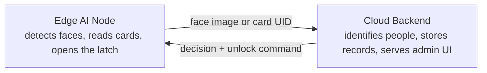

# LOCK_HYBRID_AI

Face and RFID attendance / access-control system. A door-mounted **Edge AI Node**
detects faces and reads RFID cards; a **Cloud Backend** identifies people, stores
attendance records, and serves an admin web app. Full detail lives in
[ARCHITECTURE.md](ARCHITECTURE.md) (design) and [SYSTEM_REQUIREMENTS.md](SYSTEM_REQUIREMENTS.md)
(requirements, IEEE 830 / ISO-IEC-IEEE 29148 style).

## Why the split

The door device can run a small model that finds faces, but not the much
larger model that identifies them, and it can't hold the user database. So
the device answers *"is someone there?"* and the server answers *"who is
it?"* (CON-7, CON-8 in the SRS).



## Repository Layout

```
LOCK_HYBRID_AI/
  ARCHITECTURE.md          <- system design, sequence/state diagrams, build order
  SYSTEM_REQUIREMENTS.md   <- SRS: functional, performance, accuracy, safety requirements
  EDGE_NODE/                <- door-side firmware (FRDM-MCXN947 + camera + RFID + LCD + latch)
    Camera_AI_Test1/          <- camera capture + on-device NPU face-detection bring-up project
  PCB_DES/                  <- hardware / PCB design
    LOCK_EDGE_BASEBOARD/
  CLOUD_SERVER/              <- recognition service, database, admin web app (not yet started)
```

### EDGE_NODE

`EDGE_NODE/Camera_AI_Test1` is the bring-up project for the edge device's
camera + on-NPU face-**detection** pipeline (OV7670 → SmartDMA → Edge
Impulse FOMO model on the Neutron NPU → LCD status / SD snapshot), copied
in from the standalone `Camera_AI_Test1` prototype. It proves out CON-1,
CON-3, and CON-7 from the SRS: an FRDM-MCXN947 board driving an OV7670
camera and running face detection on the integrated NPU without the
general-purpose CPU doing the main computation.

This copy keeps its own `README.md` (build/flash instructions, pinout,
hardware notes) and `ARCHITECTURE.md` (design decisions, NPU integration
details), but drops `KNOWLEDGE.md` (a general concepts primer) and
`WORKLOG.md` (the standalone prototype's dated bring-up log) — those
documented the independent history of the prototype and don't apply once
folded into this repo. The firmware source, board port, and AI model files
are unchanged from the original project.

What still needs to be added on top of this bring-up code to satisfy the
Edge AI Node requirements in the SRS: RFID reader (MFRC522) integration
(HI-2), stepper-motor latch control with fail-locked behavior (HI-3, HI-4,
SR-6), the state machine described in ARCHITECTURE.md §2.4, network
communication with the Cloud Backend over the ESP-WROOM-32E (CON-2, CI-1
to CI-5), and offline event buffering (FR-19 to FR-25).

### CLOUD_SERVER

Not yet started. Per ARCHITECTURE.md §3, this will hold the API layer,
recognition service (align → embed → match), attendance service, database,
and the admin web app.

### PCB_DES

Hardware/PCB design files for the edge baseboard (`LOCK_EDGE_BASEBOARD`).

## Build Order

See ARCHITECTURE.md §6 for the full sequencing rationale. In short: bring
up peripherals in isolation, stand up a stub server API, wire the network
path end to end, get card-based attendance fully working with no AI
involved, then bring in the detection model on the device and recognition
on the server.

## Known Limitations (by design, this release)

- **No presentation-attack (spoofing) detection** — a photo of an enrolled
  person may be sufficient to obtain access (SR-7). Sites needing
  protection against this must not rely on face recognition as the sole
  access control.
- Face-based access is not available while offline; only card-based access
  can optionally work offline, using cached authorization data (FR-23,
  FR-24).
